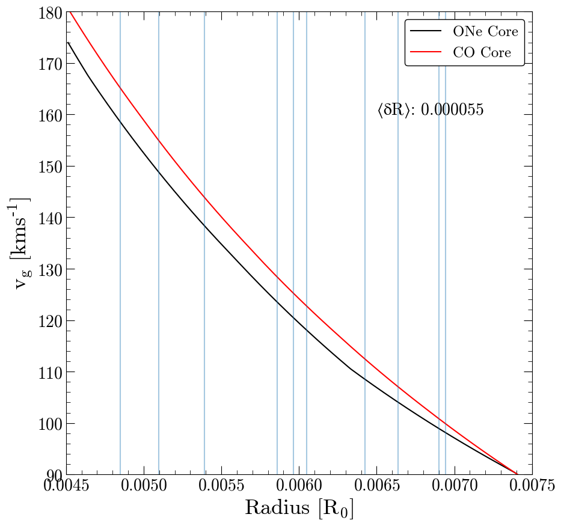

# wd-core-composition

Ultimate goal: measure the core composition of individual white dwarfs in wide binaries.

So far I've written a script to identify the `n=10` high-mass (`R < 0.007 Rsun`) WD+MS wide binaries in the El-Badry catalog with the lowest radius uncertainty. These are the best possible targets for an observing program. If we're going to write a Gemini proposal, this is how we'll identify our targets.

